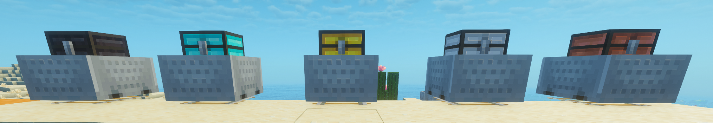

# Reinforced Minecarts

Tiered high-capacity chest minecarts for Minecraft 26.2 / Fabric, built as a companion mod for the
[Reinforced Storage 26.2 Community Port](https://github.com/mavrikakis9099-boop/reinforced-storage-26-2-community-port).



Reinforced Minecarts combines a vanilla minecart with each Reinforced Chests tier. The result keeps
vanilla-like chest-minecart movement and automation while using the matching reinforced storage
capacity and chest appearance.

> **Project status:** community companion mod. This is not an official Aton-Kish release or endorsement.

## Version

Current release: **1.0.0+26.2**

V1 is intentionally capacity-focused. It does not add tier-specific movement speed, transfer speed,
durability, explosion resistance, filtering, sorting, coupling or routing bonuses.

## Tiers and capacities

| Tier | Capacity |
| --- | ---: |
| Copper Minecart | 45 slots |
| Iron Minecart | 54 slots |
| Gold Minecart | 81 slots |
| Diamond Minecart | 108 slots |
| Netherite Minecart | 108 slots |

Each recipe is shapeless: combine the matching reinforced chest with a vanilla minecart.

## Requirements

- Minecraft 26.2
- Fabric Loader 0.19.5 or newer
- Fabric API 0.160.0+26.2
- Java 25
- **Reinforced Chests 4.0.0-beta+26.2-port.14**
- Reinforced Core 4.0.9+26.2-port.14, supplied by the Build 14 Reinforced Chests JAR

Reinforced Barrels and Reinforced Shulker Boxes are **not** required.

Download the required Reinforced Chests build from the
[Reinforced Storage 26.2 Community Port](https://github.com/mavrikakis9099-boop/reinforced-storage-26-2-community-port).

## Installation

1. Install Fabric Loader for Minecraft 26.2.
2. Install Fabric API.
3. Install the Build 14 Reinforced Chests JAR from the Reinforced Storage community port.
4. Add `reinforced-minecarts-1.0.0+26.2.jar` to your `mods` folder.
5. Start the game and verify that the reinforced minecarts appear in-game.

## Behaviour

Reinforced Minecarts subclasses Minecraft's vanilla chest-minecart implementation. Vanilla code
continues to handle rail movement, collisions, hopper access, comparator behaviour, persistence,
destruction and content drops.

The mod changes only the tier-derived storage size, tier item/entity registration, the large
Reinforced Storage menu, and the displayed reinforced chest texture.

Placed minecarts use the existing Reinforced Chests chest sprites, so compatible Reinforced Chests
resource packs can also style the mounted chest without Minecarts-specific texture patches.

## Source and building

The `reinfminecart/` module contains the Minecarts source.

For reproducible 1.0.0 builds, this repository also includes source snapshots of the exact Build 14
`reinfcore` and `reinfchest` dependencies under `vendor/`. They are build dependencies and are **not**
bundled as duplicate runtime mods inside the Reinforced Minecarts JAR.

With Java 25 and a Gradle 9.5-compatible installation:

```bash
bash tools/build.sh
```

The distributable Minecarts JAR is copied to `reinfminecart/dist/`.

See [docs/DEVELOPMENT.md](docs/DEVELOPMENT.md) for the source layout and
[docs/VALIDATION.md](docs/VALIDATION.md) for the validation record.

## Validation

The 1.0.0 build passed the recorded automated source/build checks and owner testing for crafting,
recipe discovery, names, item sprites, all five placed tier renderers, basic inventory interaction,
ordinary rail movement, hopper automation and third-party Reinforced Chests texture-pack overrides.

Some extended manual cases remain explicitly unchecked in the validation matrix; the project does
not claim those checks as completed.

## Related project

- [Reinforced Storage 26.2 Community Port](https://github.com/mavrikakis9099-boop/reinforced-storage-26-2-community-port)

## Credits

- **Nicholas Mavrikakis** — Reinforced Minecarts project and 26.2 integration work
- **Aton-Kish** — Reinforced Storage foundation and MIT-licensed upstream work

Upstream projects:

- https://github.com/Aton-Kish/reinforced-chests
- https://github.com/Aton-Kish/reinforced-core

## License

MIT. See [LICENSE](LICENSE) and [THIRD_PARTY.md](THIRD_PARTY.md).
